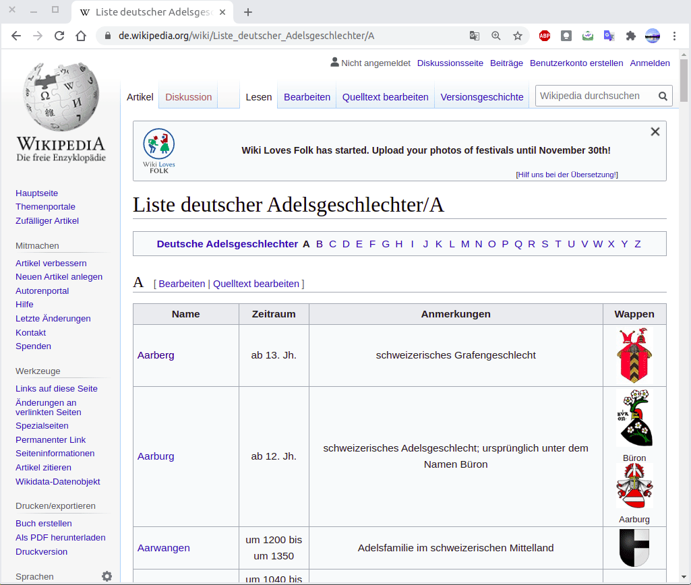
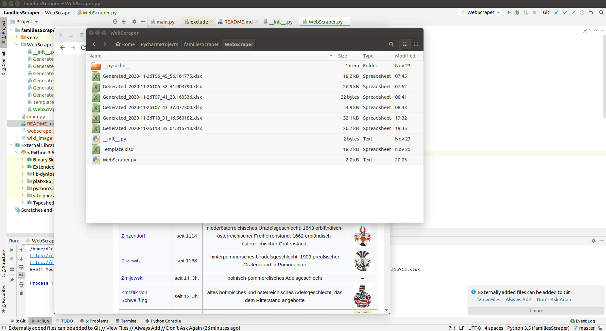

# Python WebScraper and Writer Workbook Excel file

## A simple python scraper 

[WebScraper.py](./WebScraper/WebScraper.py) makes a walk-through over this [wiki page](https://de.wikipedia.org/wiki/Liste_deutscher_Adelsgeschlechter/) visiting each of those pages between the specified letters. 

## How it works

Get the page content using `urllib.request.urlopen(url)`, then parse html with **[BeautifulSoup](https://pypi.org/project/beautifulsoup4/)** including this param as `features=html.parser`.
Then we're able to dive into the html content and filter the elements we're looking for.
In this case, the table has a unique identifier so we search `table` elements with `class` attribute as `wikitable`.
 Then we iterate over each row, get the first column and extract the name and link to be collected in a python list. 

## How looks the generated output

